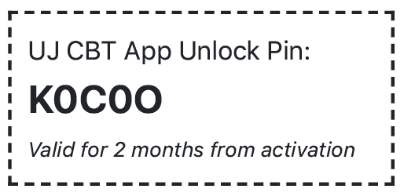

# CBT Practice
CBT Practice helps undergraduate students of the University of Jos practice for their computer-based examinations. This repository houses the *Android* app. Asscoiated repositories are as follows:
* The [CBT Practice Webapp](https://github.com/okibeogezi/cbt-practice-web)
* The [CBT Practice Question Submitter](https://github.com/okibeogezi/cbt-practice-question-submitter)

## Get it here

## The Problem
While studying computer science at the University of Jos, I observed that although students had been taking computer-based exams for years, there was no convenient and cheap way for them to access the past questions. The best solution at the time was for students to make photocopies of the past questions. This was problematic for two reasons:
* Photocopying these past questions were fairly expensive as there were up to hundreds of pages in some cases.
* Students typically made these photocopies about a week to the day of the exam and discarded them afterwards. This leads to [pollution](https://en.wikipedia.org/wiki/Environmental_impact_of_paper).

## My Solution
My solution, CBT Practice, allows students of the University to practice on their android mobile devices. The students had access to instand feedback on their performance as well as corrections after taking the practice exam.

## User Access
Users are able to access the app's content for a fee of ₦200. This fee could either be paid online on the app itself or used to buy a paper PIN which looks like this.

## User Support
Phone numbers of support personnel were provided within the app, but the most common way for users to receive support was the [CBT Practice WhatsApp group](https://chat.whatsapp.com/I9aDaWoaxydJJxcu9f7sQv).

## Important note
In order to test the app you must do the following:
* Create a Firebase project, initialize cloud messaging, firestore, auth, and cloud storage then download a `google-services.json` file
* Set `facebook_application_id` in your strings.xml
* Set `fb_login_protocol_scheme` in your strings.xml
* Set `app_admob_id` in your strings.xml

## Screenshots
