# CBT Practice
CBT Practice helps undergraduate students of the University of Jos practice for their computer-based examinations. This repository houses the *Android* app. Asscoiated repositories are listed below. Please note that the second repository is private. If you would like me to make it open-source, kindly message me so that I can prioritize doing that.
* [CBT Practice Webapp](https://github.com/okibeogezi/cbt-practice-web)
* [CBT Practice Question Submitter](https://github.com/okibeogezi/cbt-practice-question-submitter) - This allows people with special access submit new questions to the question bank.
* CBT Practice PIN Generator - This contains CLI utilities that generates unique PINS that can be used to access the application and bundles them into a PDF document that can be printed, cut into pieces and sold

## Features
+ Thousands of questions 📚
+ 9 courses 👌
+ Validated corrections ✅
+ Timed sessions ⏱️

## Important note
To build and run the app yourself, please do the following:
* Create a Firebase project, initialize cloud messaging, firestore, auth, and cloud storage then download a `google-services.json` file and drop it in the `app/src` directory
* Set `facebook_application_id` in your strings.xml
* Set `fb_login_protocol_scheme` in your strings.xml
* Set `app_admob_id` in your strings.xml

## Courses contained
The app provides access to past questions of the following University of Jos courses
+ **CS 101** - Introduction to Computer Science
+ **CS 102** - Introduction to Computer Applications
+ **CS 201** - Computer Programming I
+ **GST 101** - Use of English and Library
+ **GST 102** - Philosophy and Logic
+ **GST 103** - Nigerian People and Culture
+ **GST 104** - History and Philosophy of Science
+ **GST 222** - Peace and Conflict Management
+ **GST 223** - Introduction to Entrepreneurial Skill

## Get it here

## Problem and Idea
This app was built to allow students of the University of Jos to prepare for their computer-based exams more effeciently an effectively. Although students had been taking computer-based exams for a few years years, there was no convenient and affordable way for them to access the past questions. The best solution at the time was for students to make bulky paper photocopies or take pictures of the past questions. 
Also, the students who made paper photocopies typically did so a few days to the exam and discarded them shortly afterwards. Using this app minimizes paper usage and [helps the environment](https://en.wikipedia.org/wiki/Environmental_impact_of_paper).

## Solution
My solution, CBT Practice, allows students of the University to practice on their android mobile devices. The students had access to instand feedback on their performance as well as corrections after taking the practice exam.

## User access
Users are able to access the app's content for a fee of ₦200. This fee could either be paid online on the app itself or used to buy a paper PIN which looks like this.
If you would like me to waive the fee so you could test the app or evaluate my work, try one of the PINS in the postproximate image. If none work, kindly contact me.

## User support
Phone numbers of support personnel were provided within the app, but the most common way for users to receive support was the [CBT Practice WhatsApp group](https://chat.whatsapp.com/I9aDaWoaxydJJxcu9f7sQv).

## Bringing this to another school
This application currently only works in the [University of Jos](https://www.unijos.edu.ng/). If you would like to work with me to bring something like this to your school, send me an email.

## App screenshots
### Login screen
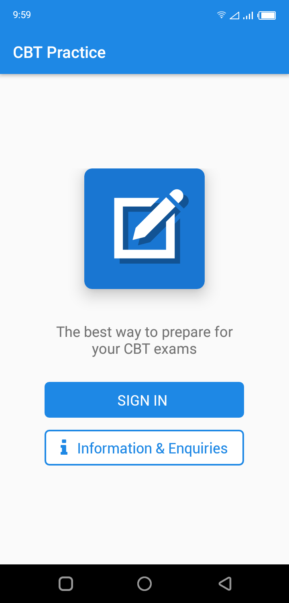

----

### Home screen
|Department list|Root hamburger menu
|-----------------------------|-------------------
|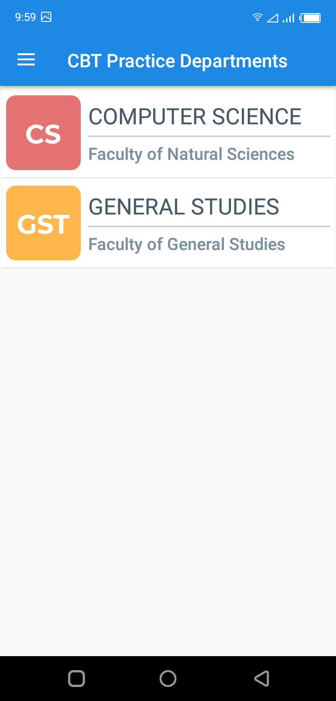|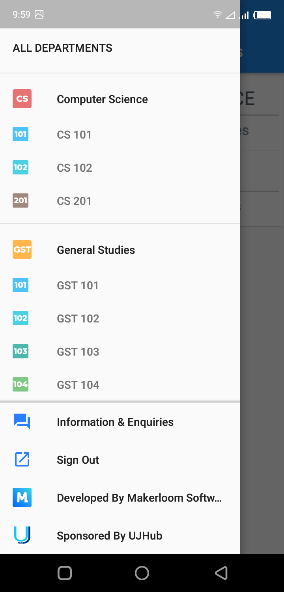

----

### Course lists
|GST course list|CS course list
|---------------|--------------
|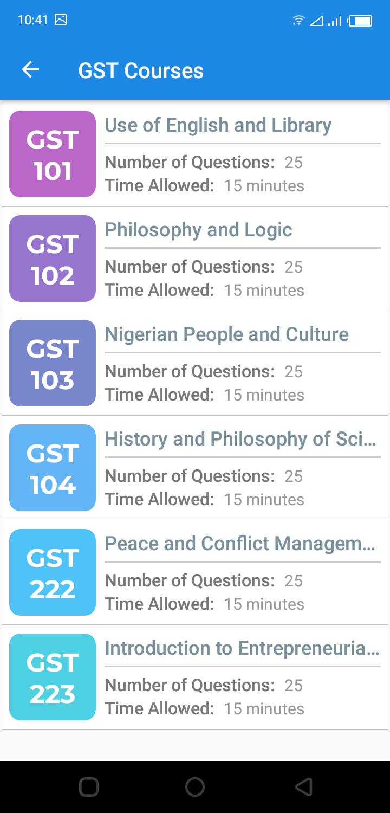|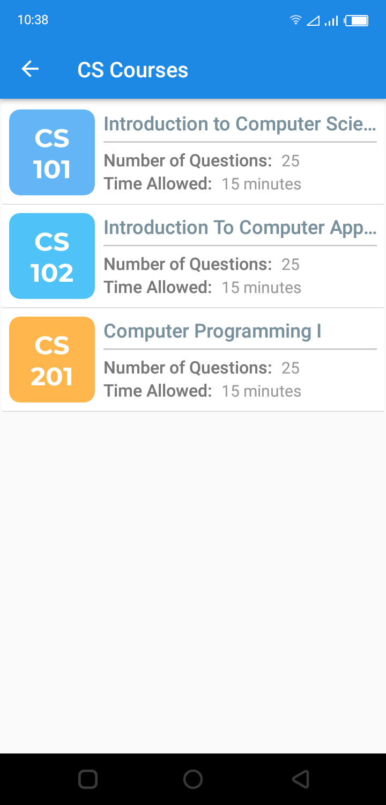

----

### Practice exam
|Normal objective question|Comprehension question|Comprehension passage|Last question
|--|--|--|--
|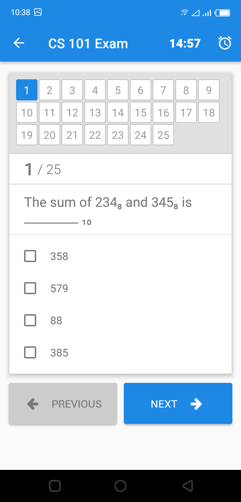|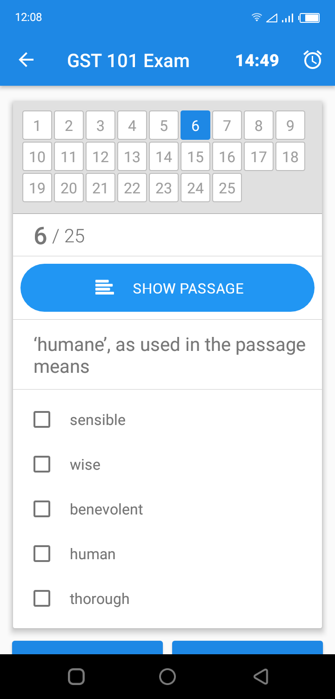|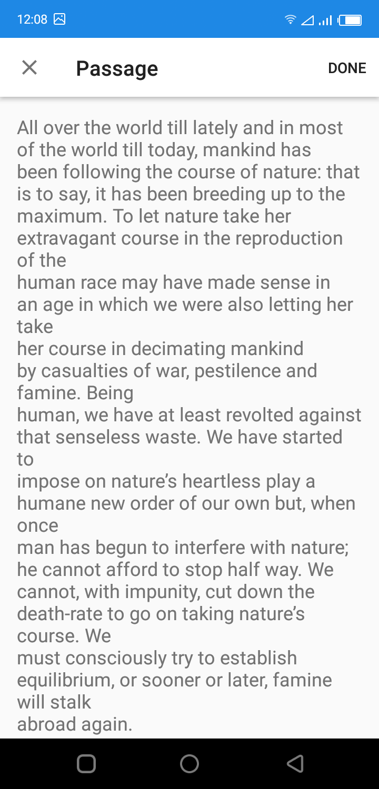|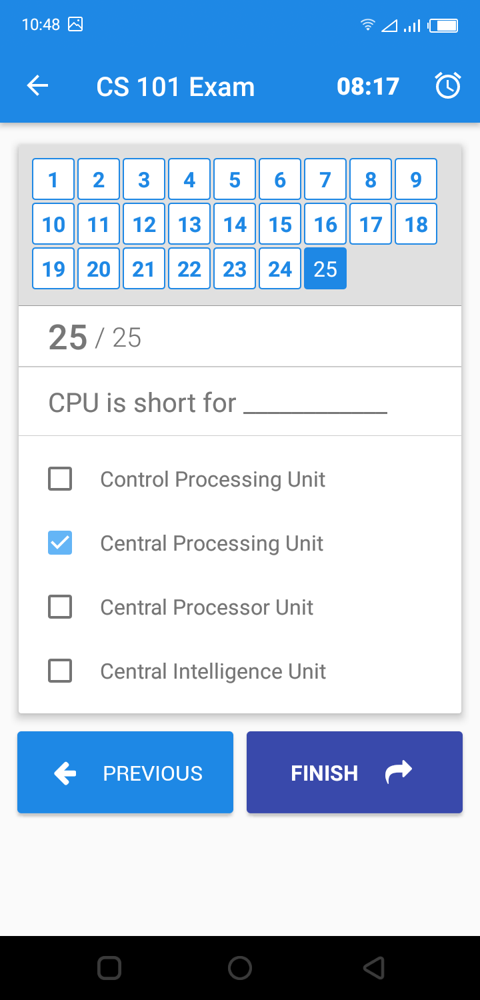

----

### Post-submission
|Score|Correction (different session from Score)
|-----|----------
|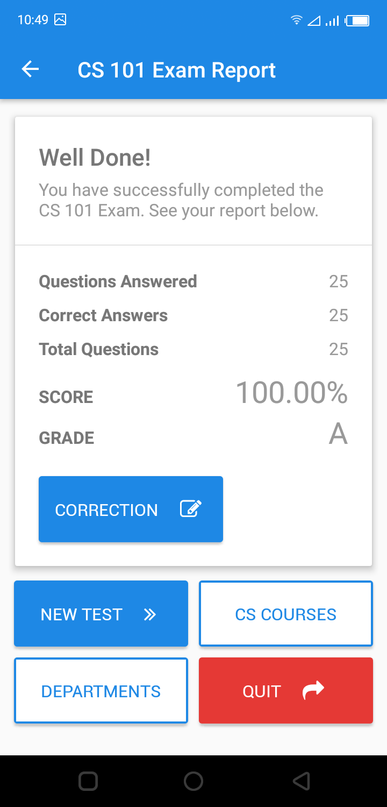|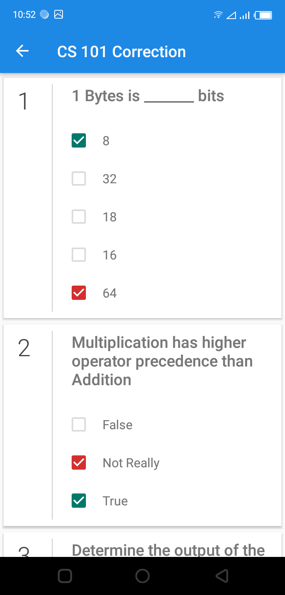
